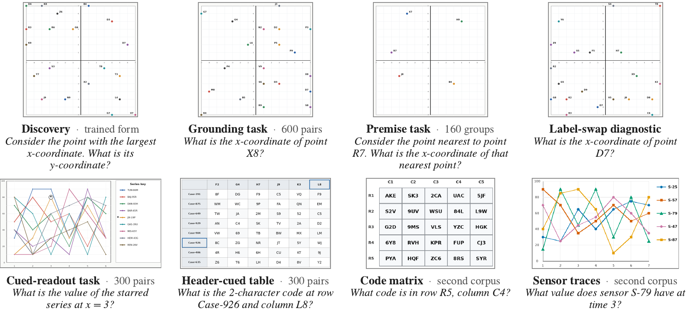

# Same Reward, Different Skills



*Eight of our nine task families: coordinate scenes on top, other formats below. You can't answer
any of them without looking at the picture, which is more or less the whole point.*

[](https://huggingface.co/datasets/Despaireyes613/learning-without-looking)

The trained model and all the data are up on Hugging Face (the yellow badge right there). Grab
whatever you need.

## The short version

Give a vision-language model a picture and a question, reward it for right answers (that's RLVR,
reinforcement learning with verifiable rewards), and its benchmark scores go up. Great.

Now do the same thing, but hide the pictures during training. Scores still go up. Less great.

Hand the real images back at test time and these blind-trained models recover roughly half of the
real-image gain at 3B and nearly four fifths at 7B. Meanwhile, if you keep training *with* real
images for a long time, benchmark accuracy peaks and then stays near-flat while grounding sinks below
the base model's. The leaderboard looks fine. The model's eyesight, not so much.

Both problems come from the same place: **an image in the prompt is not an image in the learning
signal.** A picture sitting next to the question doesn't mean the reward ever needed it. We call a
training problem *visually resolvable* when a correct answer requires the image and the task is still
learnable.

So we built some. Our counterfactual coordinate scenes change the answer whenever the image changes,
while the question stays fixed and never names the target. To get it right, you have to go find the
point. With the reward left exactly as it was, plain GRPO learns to find the target and read it:

- discovery accuracy on held-out scenes goes from **0.425 to 0.875**
- swap the test image for a gray canvas and it drops to **zero** (good, that's the idea)
- a matched-budget run trained without visual information does **not** get the gain back
- the skill **transfers** to independent grounding tasks

Same reward, different skills. Hence the title.

## What's in here

```
lwl/scenes/         the coordinate scene program: densities, roles, twins, the four cue levels
lwl/grounding/      the held-out counterfactual instruments and their regenerated twin
lwl/corpora/        Geometry3K and ViRL39K preparation, decontamination, the dose mixtures
lwl/captions/       the question-blind caption store used by the caption-condition arm
lwl/audit/          the visual-necessity audit: sampling, per-item summaries
lwl/rewards/        the training reward and its answer matcher
lwl/evaluation/     prompt contract, answer scoring, image conditions, benchmark adapters
lwl/analysis/       the statistics and the per-table rebuilders
configs/train/      the training recipes, one file per run or training segment
patches/easyr1/     the modifications to the training framework, as diffs
scripts/            command-line entry points for every stage
tests/              CPU tests
```

## Install

Python 3.10 to 3.12. Not 3.13: numpy 1.26.4 has no wheels for it, and nobody deserves to build
numpy from source.

```bash
cd learning-without-looking            # or wherever your copy lives
python3 -m venv .venv && . .venv/bin/activate
pip install -r requirements-cpu.txt    # analysis and tests
pip install -e .
pytest -q
```

Tests that need the released data are skipped until you download it. A long row of `s` is normal,
not a cry for help.

## Rebuild the paper's numbers (laptop edition)

We published the evaluation outputs of every run in the paper, item by item, so every table and
figure can be rebuilt on a laptop. No GPUs, no cluster, no begging anyone for compute:

```bash
python scripts/fetch_data.py --part predictions     # about 22 MB
python scripts/reproduce.py all --check
```

Each target writes a CSV and a JSON into `results/`. With `--check`, every rebuilt value is compared
with the value printed in the paper, so if we fat-fingered a number somewhere, the script will snitch
on us.

## Re-run the pipeline (GPU edition)

This is the "I want to train it myself" path. You'll need GPUs, the full environment, and some
patience:

```bash
pip install -r requirements.txt --extra-index-url https://download.pytorch.org/whl/cu121
python scripts/fetch_data.py --part instruments --part corpora --extract
python scripts/fetch_virl39k.py                     # the ViRL39K images, from the upstream release
bash scripts/setup_easyr1.sh                        # clone and patch the trainer
hf download Qwen/Qwen2.5-VL-7B-Instruct --local-dir artifacts/models/Qwen2.5-VL-7B-Instruct
```

The step-100 constructed checkpoints in the paper come from a 30-step config plus three segment
configs, run in order. We only saved weights, so each segment starts from the merged weights of the
one before it. Think relay race, except the baton is a 7B model:

```bash
R=constructed-standard-7b-run1
bash scripts/train.sh $R                            # steps 0-30
python scripts/merge_checkpoint.py --local_dir checkpoints/$R/global_step_30/actor
bash scripts/train.sh $R-steps30-50
python scripts/merge_checkpoint.py --local_dir checkpoints/$R-steps30-50/global_step_20/actor
bash scripts/train.sh $R-steps50-75
python scripts/merge_checkpoint.py --local_dir checkpoints/$R-steps50-75/global_step_25/actor
bash scripts/train.sh $R-steps75-100
python scripts/merge_checkpoint.py --local_dir checkpoints/$R-steps75-100/global_step_25/actor
```

Then evaluate each checkpoint on the scenes (every cue level, real and gray images) and on the
grounding suite and its twin:

```bash
MODEL=checkpoints/$R-steps75-100/global_step_25/actor/huggingface     # step 100
bash scripts/evaluate_scenes.sh --model $MODEL --out outputs/scenes --split confirmatory \
    --levels "l3 l2 l1 probe" --conditions "real gray"
bash scripts/evaluate_grounding.sh --model $MODEL --out outputs/grounding \
    --instruments "suite twin" --gpus "0 1 2 3"
python scripts/aggregate_evaluation.py --inputs "outputs/grounding/suite/shards/*.jsonl" \
    --output outputs/grounding/suite/metrics.json
```

A few more things worth knowing before you start:

- The long-horizon runs are also trained in segments, but they save full checkpoints, so each segment
  resumes the previous one exactly. The headers of `configs/train/long-horizon-*.yaml` give the order.
- The 3B recipes start from `artifacts/models/Qwen2.5-VL-3B-Instruct`.
- Rather skip training altogether? Fair enough. Fetch our checkpoint with
  `python scripts/fetch_data.py --part checkpoint` and pass
  `--model checkpoints/constructed-standard-7b-run1-step100` to the evaluation commands above.
- The ViRL39K images aren't ours to redistribute. `scripts/fetch_virl39k.py` pulls them from the
  pinned upstream release and checks each one against the SHA-256 recorded in the training rows.
- You don't need to rebuild the data (the published corpora cover it), but you can:
  `scripts/build_scenes.py` regenerates the scene sets from the scene program,
  `scripts/build_training_corpus.py` builds the constructed training rows from the training scenes,
  and `scripts/build_mixtures.py` mixes them with the filtered ViRL39K rows.
- The grounding suite and its twin ship frozen. If you want to see how the sausage was made, their
  generators are `lwl/grounding/build_suite.py` and `lwl/grounding/build_twin.py`.

## Released data

`scripts/fetch_data.py` downloads from the Hugging Face dataset repository (badge at the top):

| part | size | contents |
|---|---|---|
| `predictions` | 22 MB | per-item evaluation outputs, plus the training streams and audit rows the rebuilders read |
| `instruments` | 610 MB | the scene sets, the grounding suite and its twin, the audit inputs |
| `corpora` | 150 MB | the filtered upstream corpora, the dose mixtures, the caption stores |
| `checkpoint` | 16 GB | the 7B model trained on the constructed corpus with the standard reward |

If you only grab one thing, make it `predictions`: 22 MB, and it's what the rebuild above runs on.
The 16 GB checkpoint is for people who mean business.

## Fine print on the numbers

The section everyone skips until a number doesn't match. Save yourself the future headache:

- Pair files carry the repository's current scorer in `correct_a`, `correct_b` and `pair_correct`,
  and the flags recorded at evaluation time in the `*_as_logged` fields. Item files carry `correct`
  (the canonical matcher) and `correct_reward_matcher` (the training reward's matcher). Audit files
  carry counts and rates under both matchers.
- The tables use the current pair scorer and the canonical item matcher, with two exceptions: the
  degraded-set overlap (Figure 2c, Table E.2) uses the `*_as_logged` flags, and the resolvability
  audit of the training corpora (Section 5, Figure 3a and the mixture masses) uses the reward matcher
  (`*_reward_matcher`).
- Six printed values can't be rebuilt from the released files. The training-reward curve, for
  example, comes straight from the trainer's own log. `--check` owns up to this and reports them as
  not rebuildable.

## Licence

Apache-2.0 for the code. See `LICENSE`, plus the third-party terms in `NOTICE`.
